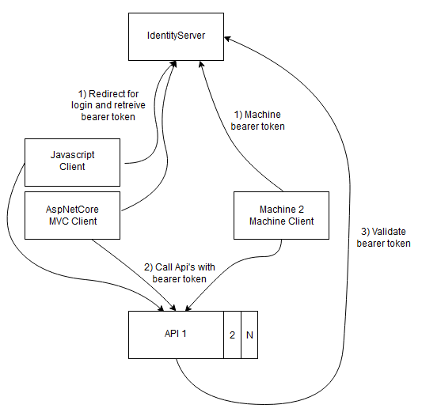

# Dotnet.IdentityServer

This project, is showing how to implement authentication with IdentityServer for a range of different scenarios.

So in this repository you will find 3 Clients using the IdentityServer. AspNetCore MVC client and a Javascript client using code flow, where a user is redirected to the IdentityServer for login, and returned with a code. The code will then be exchanged for a Bearer token, that can be used to call API's as proof you have access to the given resources. Then there is a Dotnet core Console app using client credentials flow. This would be used for background services not running in a context of a user.

There is also included an API that points at IdentityServer as Authority. You could have any number of API's as microservice in your setup. They take the bearer token they receive from the calls and validate it against IdentityServer, that the user has access to whatever resource they are trying to get.

# Setup

If you want single signon to work across clients add identity to hosts file on whatever OS you use.

eg:
127.0.0.1 Identity

If you don't want to use host mappings, just change all places where identity:5000 to localhost:5000.

run docker-compose up to start the project

Ip/port:

* http://localhost:5000 IdenitityServer
* http://localhost:5002 Dotnet MVC Project
* http://localhost:5003 Javascript Client
* http://localhost:6001 API Project

There is included a docker-compose for dependencies and seed data, if you just want MS SQL started with some predefined data.

Default users:

username "alice" and "bob" with password: Pass123$

You can add Google auth by creating your own google app account and inserting the secrets here. Remember to setup the redirect urls in your google app. They are able to redirect to localhost etc. for local development.

This is a work in progress project :) Handle with care. Alot of hardcoded IP's still in place to be fixed.

# Links

https://docs.microsoft.com/en-us/aspnet/core/security/docker-compose-https?view=aspnetcore-5.0

https://docs.microsoft.com/en-us/aspnet/core/security/docker-https?view=aspnetcore-5.0

https://docs.docker.com/engine/examples/dotnetcore/

https://github.com/IdentityServer/IdentityServer4/tree/main/samples/Clients/src

https://expressdb.io/sql-server-express-feature-comparison.html#sql-server-edition-feature-comparison

https://hub.docker.com/_/microsoft-mssql-server

https://hub.docker.com/_/postgres

https://docs.docker.com/compose/aspnet-mssql-compose/